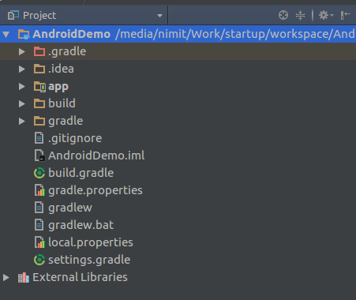
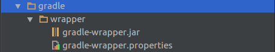
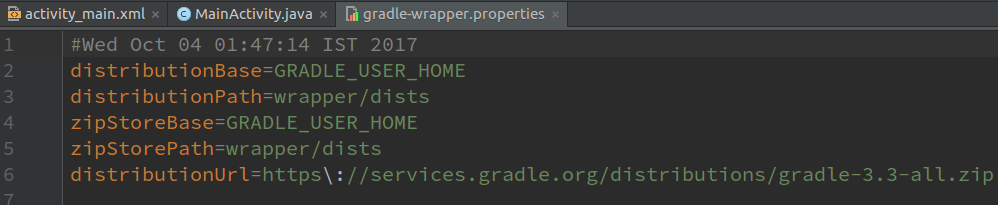
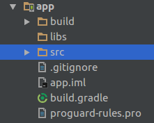
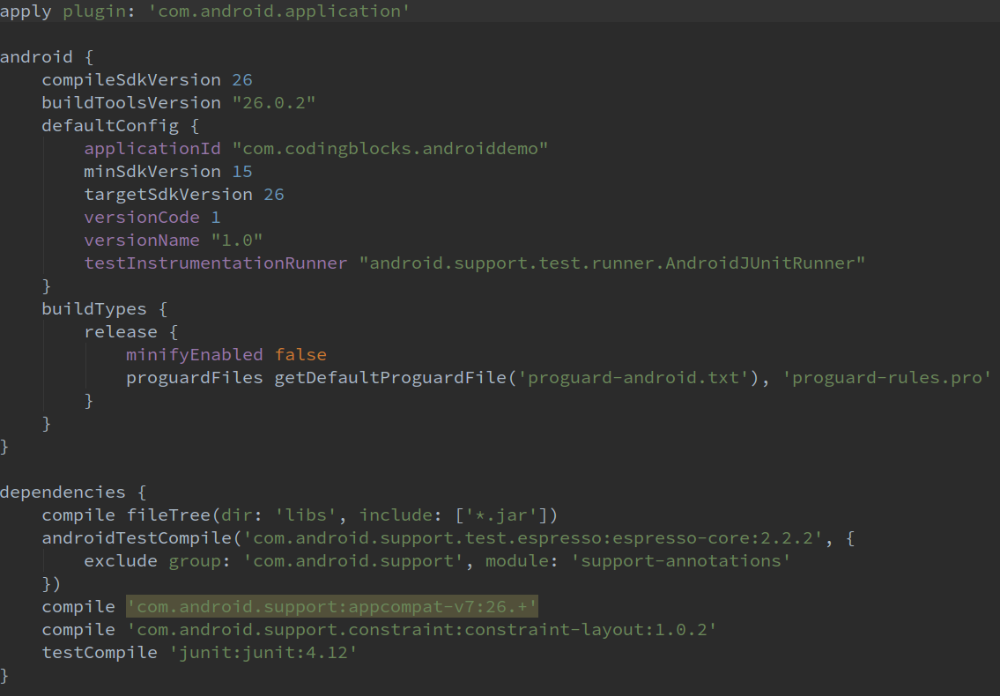
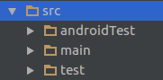
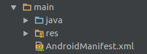
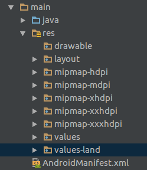

# Android Project Structure Simplified

If there is a project which consists of different type of files, we need a build tool to build the project. Build tools are programs that automate the creation of executable applications from source code(eg.apk for android app). Building incorporates compiling, linking and packaging the code into a usable or executable form.

Various tools like Ninja, Maven, MAKE and Gradle can be used to build projects. Earlier maven was used to build Android applications in eclipse. Android applications at the OS level are built using MAKE. Generally, now we use Gradle to build Android applications.

Gradle is a build tool. It configures how an app is built. There are certain tasks which need to be performed to build an Android Application like Javac compiles java files, XML needs to be encoded, images are compressed and much more. Gradle manages this build system and performs the necessary tasks.    

Now we understand the role of Gradle in building an Android application, we can now move to understanding the basic project structure.

The basic structure of an Android Application built using Gradle is shown below. It has many folders inside AndroidDemo folder, we would study each of them in detail. ('app' folder is explained at the end)

* **AndroidDemo**

    AndroidDemo is our project name. One project can have more than one application and module. By default, there is only one application in the 'app' folder. You can add more apps in this folder. The reason we want our project to have more than one application is to share data among themselves.

    * **.gradle**

      This is a hidden folder. It is used to store downloaded librararies and Gradle cache. It also contains Snapshots and other automatically generated files. Generally there is no need to change anything in this folder.

    * **.idea**

      Android Studio is based on Intellij by Jetbrain. All Intellij IDEs store settings in '.idea' folder of the project. Example if you increase font for a particular file in Android Studio, the font size remains same when you open the file next time. All these type of settings are stored in this folder.

    * **bulid**

      When we build an android app various temporary files are generated like compiled files, compressed files. So these generated files are present in this folder. Build folder contents can be deleted to start a clean build a project.

    * **Gradle**

      

      
      [File Link](./AndroidDemo/gradle/wrapper/gradle-wrapper.properties)

      In Gradle folder, we have a wrapper folder, which has a file for gradle properties. It denotes version of the gradle that is to be used to build the project. Android Studio automatically makes it to the latest version available.

    * **gradle.properties**

      This file has gradle properties needed at the time of execution. Like you can set the RAM limit consumed by Gradle.

    * **[bulild.gradle](./AndroidDemo/build.gradle)**

        We are depending on gradle plugin to run our project. In this file gradle plugin version is mentioned for the whole project. Android Studio version and gradle plugin version should be same. If you open an earlier project then this version should be changed to match the current Android Studio version.

    * **[settings.gradle](./AndroidDemo/settings.gradle)**

        In the project modules which are needed to be built are listed in this file. By default it only has 'app'.

    * **app**

        This is the default application/module folder named as 'app'. It has all the folders and files associated with our apllication.

        

        * **[build.gradle](./AndroidDemo/app/build.gradle)**

            
            
            This is the gradle file pertaining to the module.

        * **src**

            This folder contains all the source files of the project.  MultiFlavor of the app.

            

            * **androidTest**

                This folder contains the test files written to test android functions.
            * **test**

                This folder contains the test files written to test Java functions.
            * **main**

                This contains the main source code of the application. Whenever an apk is generated it contains source code present in this folder. So this forms the core components of the app.

                

                * **[Andorid Manifest](./AndroidDemo/app/src/main/AndroidManifest.xml)**

                    It is most important file for an Android App.Every application must have an AndroidManifest.xml file (with precisely that name) in its root directory. In an app Java or resource files are optional. Apps that runs as service don't have any resource associated. Apps like launcher pack does not have any java files associated to them. But each of them has manifest attached to them.
                    It is neccessary to have a manifest for valid android application.
                    It contains tags like application(So OS identify it as android application), package name, label (Name of application on launcher)

                * **java**

                    This folder contains all the java files of our Android application.

                * **res**

                    

                    This containes all the resource files required in our application. They logically segregated to their respective folders.

                    Images needed in the app should be put in drawable folder.
                    Images required by the OS associated with our app are put in mipmap eg launcher Icon.

                    Layout containes the Android XML layout files which can be used in activities or fragment.

                    Values folder contains values like colors, dimension, string. These values can be referenced in our app java files.

                    We can also create enviornment specific resource folders. Enviornments include oritentaion of the phone, display density etc can be chosen from.
                    Folder name followed followed by hyphen followed by a specifier is used to create such folders.
                    Eg. values-land, values defined in this folder would be specific to landscape oritentaion of the phone. For potrait mode default values in 'values' folder will be used.
                    Specific folders just overrides the value if phone is in that specific enviornmebt otherwise fall back to the default values.
